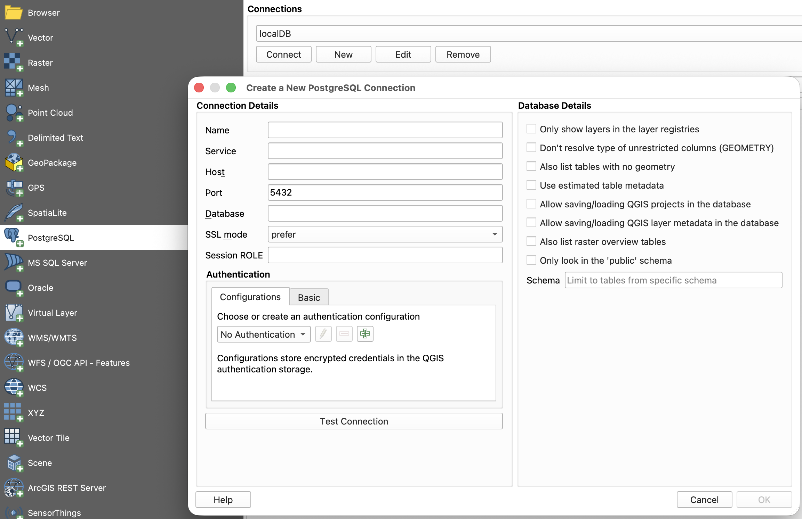

[](https://github.com/kartoza/docker-postgis/actions/workflows/build-latest.yaml)
[](https://github.com/kartoza/docker-postgis/actions/workflows/deploy-image.yaml)

# Table of Contents

- [Table of Contents](#table-of-contents)
- [docker-postgis](#docker-postgis)
  * [Overview](#overview)
  * [Tagged versions](#tagged-versions)
  * [Getting the image](#getting-the-image)
  * [Running the container](#running-the-container)
    + [Using the terminal](#using-the-terminal)
    + [Convenience docker-compose.yml](#convenience-docker-composeyml)
  * [Interacting with the database](#interacting-with-the-database)
    + [Connect via psql client](#connect-via-psql-client)
    + [Connect via GIS Desktop](#connect-via-gis-desktop)
  * [Docker image versions](#docker-image-versions)
  * [Advanced Documentation](#advanced-documentation)
  * [Support](#support)
  * [Credits](#credits)

# docker-postgis

## Overview

A simple docker container that runs PostGIS


Highlights and feature of this image:

* Provides SSL support out of the box and enforces SSL client connections
* Connections are restricted to the docker subnet
* A default database `gis` is created for you so you can use this container '*out of the box*' when
    it runs with e.g. `QGIS`
* Streaming replication and logical replication support included (turned off by default)
* Ability to create multiple database when starting the container.
* Ability to create multiple schemas when starting the container.  
* Enable multiple extensions in the database when setting it up.
* `Gdal` drivers automatically registered for pg raster.
* Support for out-of-db rasters.


There is a nice 'from scratch' tutorial on using this docker image on Alex Urquhart's blog
[here](https://alexurquhart.com/post/set-up-postgis-with-docker/) - if you are just getting started
with `docker`, `PostGIS` and `QGIS`, we recommend that you read it and try out the instructions
specified on the blog.

## Tagged versions

The following convention is used for tagging the images we build:

> kartoza/postgis:[POSTGRES_MAJOR_VERSION]-[POSTGIS_MAJOR_VERSION].[POSTGIS_MINOR_RELEASE]

So for example:

``kartoza/postgis:17-3.5`` Provides PostgreSQL 17.0, PostGIS 3.5

**Note:** We highly recommend that you use tagged versions because successive minor versions of
`PostgreSQL` write their database clusters into different database directories - which will cause
your database to appear to be empty if you are using persistent volumes for your database storage.

## Getting the image

To get the image onto your system:

* Pulling from Central Registry (Dockerhub)
* Building locally - [Consult the Developer Guidelines](https://github.com/kartoza/docker-postgis/blob/develop/Developer-Guidelines.md)


## Running the container


### Using the terminal

To create a running container do:

```shell
docker run --name "postgis" -p 25432:5432 -d -t kartoza/postgis
```

**Note:** If you do not pass the env variable `POSTGRES_PASS` a random password will be generated
and will be visible from the logs or within the container in `/tmp/PGPASSWORD.txt`.

### Convenience docker-compose.yml

For convenience, we  provide a ``docker-compose.yml`` that will run a
copy of the database image and also our related database backup image (see
[https://github.com/kartoza/docker-pg-backup](https://github.com/kartoza/docker-pg-backup)).

The `docker-compose` recipe will expose `PostgreSQL` on port `25432` (to prevent potential conflicts with
any local database instance you may have),

Example usage:

```shell
docker-compose up -d
```

**Note:** The docker-compose recipe above will not persist your data on your local disk, only in a
`docker` volume.

## Interacting with the database

### Connect via psql client

Connect with psql (make sure you first install postgresql client tools on your host / client):

```shell
psql -h localhost -U docker -p 25432 -l
```

**Note:** Default postgresql user is 'docker'. If you do not pass the env variable `POSTGRES_PASS`
a random strong password will be generated and can be accessed within the startup logs.

You can then go on to use any normal postgresql commands against the container.

Under ubuntu LTS the postgresql client can be installed like this:

```shell
sudo apt-get install postgresql-client-${POSTGRES_MAJOR_VERSION}
```

Where `POSTGRES_MAJOR_VERSION` corresponds to a specific
PostgreSQL version i.e 12

### Connect via GIS Desktop

1) Open QGIS Desktop and choose Data Source Manager.
2) Select PostgreSQL Connector
3) Populate the credentials as per the running container.
  
  

4) Connect to the database and start interacting with your data.

## Advanced Documentation

This README focuses on simplicity. Additional documentation covering advanced configuration and examples can be found here:

* [Advanced-Configuration](https://github.com/kartoza/docker-postgis/blob/develop/Advanced-Configuration.md)
* [Developer-Guidelines](https://github.com/kartoza/docker-postgis/blob/develop/Developer-Guidelines.md)


## Docker image versions

All instructions mentioned in the README are valid for the latest running image. Other docker
images might have a few missing features than the ones in the latest image. We mainly do not back
port changes to current stable images that are being used in production. However, if you feel that
some  changes included in the latest tagged version of the image are essential for the previous
image you can cherry-pick the changes against that specific branch and we will test and merge.

## Support

If you require more substantial assistance from [kartoza](https://kartoza.com) (because our work
and interaction on docker-postgis is pro bono), please consider taking out a
[Support Level Agreement](https://kartoza.com/en/shop/product/support).

## Credits

- Tim Sutton (tim@kartoza.com)
- Gavin Fleming (gavin@kartoza.com)
- Rizky Maulana (rizky@kartoza.com)
- Admire Nyakudya (admire@kartoza.com)


